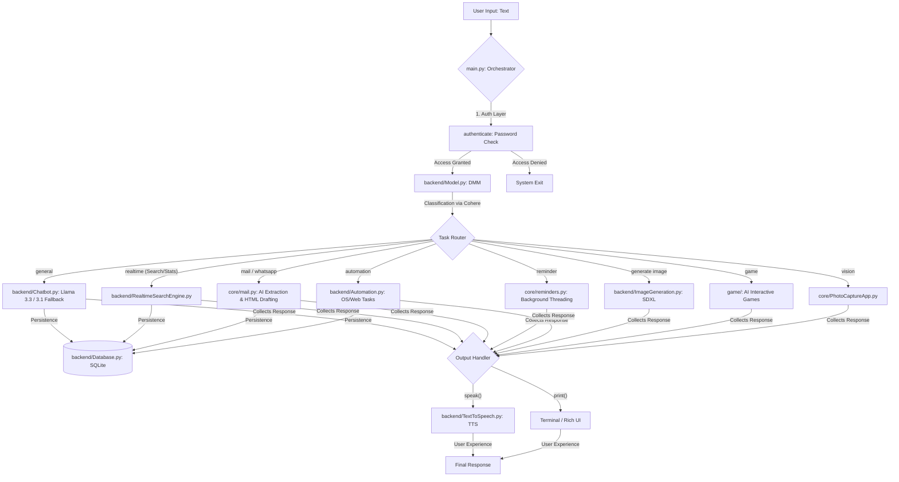

# Friday AI Assistant: Advanced Modular Ecosystem

Friday is a cutting-edge personal AI assistant built with a decentralized Python architecture. It leverages a sophisticated multi-model strategy to provide real-time information, system automation, and intelligent communication.

## 🏗️ Architectural Overview

Friday operates on a **Research -> Strategy -> Execution** lifecycle, visualized in the following system architecture:



Friday's decentralized logic ensures that each module operates independently, while `main.py` maintains the state and security of the entire session.

---

## 🚀 Key Features & Capabilities

### 🧠 Intelligent Conversational Core
- **Multi-Model Routing**: Seamlessly switches between Groq (Llama 3.3/3.1) for chat and Cohere (Command-R) for intent classification.
- **Real-time Intelligence**: DuckDuckGo search integration via `RealtimeSearchEngine.py` for up-to-date answers.
- **Context Awareness**: Persistent chat history managed via SQLite for coherent long-term conversations.

### 📷 Vision & Photography
- **Webcam Integration**: Capture photos directly through the assistant (`PhotoCaptureApp.py`).
- **Termux Camera Support**: Specialized support for mobile photography via Termux API.

### 📧 Intelligent Communication (AI-Enhanced)
- **Natural Language Extraction**: Tell Friday "Send an email to X about Y," and it will automatically extract the recipient and subject.
- **Professional Drafting**: Generates long-form, sophisticated emails with perfect HTML spacing.
- **WhatsApp Integration**: Automated messaging workflow.

### 🛠️ System & Task Automation
- **Multi-Threaded Reminders**: Set background timers with audible beep alerts and voice notifications.
- **Deep System Control**: Manage volume, take screenshots, and open/close applications or websites.
- **Power Management**: Shutdown, restart, or sleep your system via voice or text commands.
- **File Management**: Quickly create folders and organize content.

### 🔍 System Intelligence & Creativity
- **Hardware Monitoring**: Real-time tracking of CPU and RAM performance.
- **Live Information**: Instant access to weather, news, Wikipedia summaries, and jokes.
- **Creative Suite**: AI-powered 4K image generation using Stable Diffusion XL (Hugging Face).

### 🎮 Gaming Module
- **Interactive Games**: Collection of built-in games including Tic Tac Toe, Snake, Ball Bouncing, and Rock Paper Scissors.

---

## 💻 Technology Stack

- **Core**: Python 3.10+
- **LLMs**: Groq (Llama 3.3/3.1), Cohere (Command-R), Hugging Face (SDXL).
- **Automation**: `pyautogui`, `AppOpener`, `pywhatkit`, `selenium`.
- **Database**: SQLite (for persistent chat history and context).
- **UI/UX**: Rich (Terminal Formatting), `edge-tts` / `pyttsx3` (TTS).
- **Networking**: `smtplib` (Email), `requests` (APIs).
- **Platform**: Fully compatible with **Windows** and **Android (Termux)**.

---

## 🛠️ Setup & Installation

1.  **Clone the Repository** and navigate to the project root.
2.  **Run Setup Script**:
    ```bash
    chmod +x setup.sh
    ./setup.sh
    ```
3.  **Configure Environment**: If you didn't use the setup script or want to edit it manually, ensure your `.env` file has the following:
    ```env
    USERNAME="YourName"
    GROQ_API_KEY="your_groq_key"
    COHERE_API_KEY="your_cohere_key"
    SENDER_EMAIL="your_gmail@gmail.com"
    EMAIL_PASSWORD="your_16_char_app_password"
    HUGGINGFACE_API_KEY="your_hf_key"
    OPENWEATHER_API_KEY="your_weather_key"
    NEWS_API="your_news_key"
    ```
3.  **Install Dependencies**:
    ```bash
    pip install -r requirements.txt
    ```
4.  **Run Friday**:
    ```bash
    python main.py
    ```

## ⚖️ License
This project is intended for personal automation and educational exploration of multi-model AI systems.
